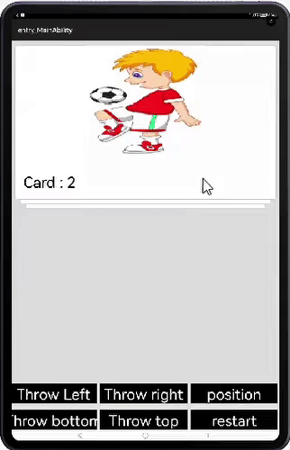

# SwipeCardsView

## Demo



## Source
This library has been inspired by [Arjun-sna/android-swipecards-view](https://github.com/Arjun-sna/android-swipecards-view)
## Integration
**From Source**
1. For using SwipeCardsView module in sample app, include the source code and add the below dependencies in entry/build.gradle to generate hap/support.har.
    ```groovy
    implementation project(path: ':swipecardlib')
    ```
2. For using SwipeCardsView module in separate application using har file, add the har file in the entry/libs folder and add the dependencies in entry/build.gradle file.
    ```groovy
   implementation fileTree(dir: 'libs', include: ['*.har'])
   

## Usage
Add `SwipeCardView` to the layout xml file where it is needed
```xml
<in.arjsna.swipecardlib.SwipeCardView
    ohos:id="$+id:card_stack_view"
    ohos:height="0"
    ohos:width="match_parent"
    ohos:weight="1"
    swipecard:rotation_degrees="15.5"
    />
```
The various customisation attribures available are

`max_visible` - maximum card to be show in stack as visible

`min_adapter_stack` - minimum card count left at which callback about adapter to empties will be called

`left_swipe_detect` - whether swipe to lelf should be enabled or not. `true` by default

`right_swipe_detect` - whether swipe to right should be enabled or not. `true` by default

`top_swipe_detect` - whether swipe to top should be enabled or not. `true` by default

`bottom_swipe_detect` - whether swipe to bottom should be enabled or not. `true` by default

Create an `ArrayAdapter` with card list
```java
CardsAdapter arrayAdapter = new CardsAdapter(this, al );
```

Set the adapter and fling listener to SwipeCardView
```java
SwipeCardView swipeCardView = (SwipeCardView) findComponentById(ResourceTable.Id_card_stack_view);

        swipeCardView.setAdapter(arrayAdapter);
        swipeCardView.setFlingListener(new SwipeCardView.OnCardFlingListener() {
            @Override
            public void onCardExitLeft(Object dataObject) {
                makeToast("Left !");
            }

            @Override
            public void onCardExitRight(Object dataObject) {
                makeToast("Right !");
            }

            @Override
            public void onAdapterAboutToEmpty(int itemsInAdapter) {
                // pass
            }

            @Override
            public void onScroll(float scrollProgressPercent) {
                // pass
            }

            @Override
            public void onCardExitTop(Object dataObject) {
                makeToast("Top !");
            }

            @Override
            public void onCardExitBottom(Object dataObject) {
                makeToast("Bottom !");
            }
        });

        swipeCardView.setOnItemClickListener((itemPosition, dataObject) ->
                makeToast("itemPosition: " + itemPosition)
        );

```

The cards can be removed by code with fling animation

```java
swipeCardView.throwRight(); //throw card to right
swipeCardView.throwLeft(); //throw card to left
swipeCardView.throwTop(); //throw card to top
swipeCardView.throwBottom(); //throw card to bottom
```

Take a look at the [sample project](entry) for more information.

License
=======

Licensed under the Apache License, Version 2.0 (the "License"); you may not use this work except in compliance with the License.
You may obtain a copy of the License in the LICENSE file, or at:

http://www.apache.org/licenses/LICENSE-2.0

Unless required by applicable law or agreed to in writing, software distributed under the License is distributed on an "AS IS" BASIS, WITHOUT WARRANTIES OR CONDITIONS OF ANY KIND, either express or implied. See the License for the specific language governing permissions and limitations under the License.
